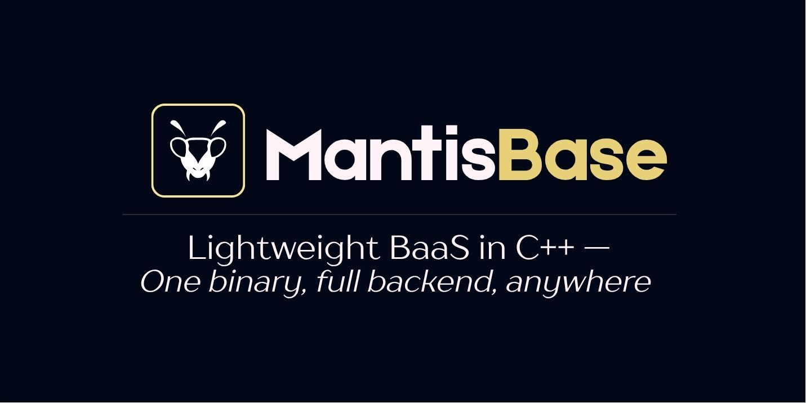

<p align="center">
  
</p>

<p align="center">
  <strong>A lightweight, pluggable Backend-as-a-Service (BaaS) library built in C++</strong><br />
  Portable. Embeddable. Built for speed and extensibility.
</p>

---

## What is MantisBase?

MantisBase is a lightweight C++ library that provides a complete backend solution with:
- **Auto-generated REST APIs** - Create database tables and get instant REST endpoints
- **Built-in Authentication** - JWT-based auth with access control rules
- **Admin Dashboard** - Web interface for managing your data
- **File Uploads** - Handle file storage and serving
- **JavaScript Extensions** - Extend functionality with scripts
- **Embeddable** - Use as a library in your C++ applications

Perfect for embedded devices, desktop apps, or standalone servers.

---

## Quick Start

### 1. Download and Run

Download the latest release from [GitHub Releases](https://github.com/allankoechke/mantisbase/releases), extract it, and run:

```bash
./mantisbase serve
```

The server starts on `http://localhost:7070` with:
- API endpoints at `http://localhost:7070/api/v1/`
- Admin dashboard at `http://localhost:7070/mb`

### 2. Create Admin Account

Before using the admin dashboard, create an admin user:

```bash
./mantisbase admins --add admin@example.com very_string_password_123!@h
```

Once admin user has been created, log in at `http://localhost:7070/mb`.

### 3. Create Your First Entity

Use the admin dashboard or API to create a table. For example, create a `posts` table:

```bash
curl -X POST http://localhost:7070/api/v1/schemas \
  -H "Authorization: Bearer <admin_token>" \
  -H "Content-Type: application/json" \
  -d '{
    "name": "posts",
    "type": "base",
    "fields": [
      {"name": "title", "type": "string", "required": true},
      {"name": "content", "type": "string"}
    ],
    "rules": {
      "list": {"mode": "public", "expr": ""},
      "get": {"mode": "public", "expr": ""},
      "add": {"mode": "auth", "expr": ""},
      "update": {"mode": "auth", "expr": ""},
      "delete": {"mode": "", "expr": ""}
    }
  }'
```

### 4. Use Your API

Once created, your entity automatically gets REST endpoints:

```bash
# List all posts
curl http://localhost:7070/api/v1/entities/posts

# Create a post (requires authentication)
curl -X POST http://localhost:7070/api/v1/entities/posts \
  -H "Authorization: Bearer <token>" \
  -H "Content-Type: application/json" \
  -d '{"title": "My First Post", "content": "Hello World!"}'

# Get a specific post
curl http://localhost:7070/api/v1/entities/posts/<id>

# Update a post
curl -X PATCH http://localhost:7070/api/v1/entities/posts/<id> \
  -H "Authorization: Bearer <token>" \
  -H "Content-Type: application/json" \
  -d '{"title": "Updated Title"}'

# Delete a post
curl -X DELETE http://localhost:7070/api/v1/entities/posts/<id> \
  -H "Authorization: Bearer <token>"
```

That's it! You now have a fully functional backend with authentication and access control.

---

## Installation Options

### Option 1: Pre-built Binaries (Recommended for Beginners)

1. Download from [GitHub Releases](https://github.com/allankoechke/mantisbase/releases)
2. Extract the zip file
3. Run `./mantisbase serve`

### Option 2: Build from Source

**Dependencies (Linux only):**
```bash
sudo apt-get install -y libzstd-dev libpq-dev
```

```bash
git clone --recurse-submodules https://github.com/allankoechke/mantisbase.git
cd mantisbase
cmake -B build
cmake --build build
./build/mantisbase serve
```

### Option 3: Embed in Your Project

Add MantisBase as a submodule and link it in your CMake project:

```cpp
#include <mantisbase/mantisbase.h>

int main(int argc, char* argv[])
{
    auto& app = mb::MantisBase::create(argc, argv);
    return app.run();
}
```

See [Embedding Guide](doc/05.embedding.md) for details.

### Option 4: Docker

```bash
docker build -t mantisbase -f docker/Dockerfile .
docker run -p 7070:80 mantisbase
```

See [Docker Guide](doc/06.docker.md) for details.

---

## Key Features

### Auto-generated REST APIs

Every entity (table) you create automatically gets REST endpoints:

- `GET /api/v1/entities/<entity>` - List records
- `GET /api/v1/entities/<entity>/:id` - Get record
- `POST /api/v1/entities/<entity>` - Create record
- `PATCH /api/v1/entities/<entity>/:id` - Update record
- `DELETE /api/v1/entities/<entity>/:id` - Delete record

### Authentication

Standalone authentication endpoints:

- `POST /api/v1/auth/login` - User login
- `POST /api/v1/auth/refresh` - Refresh token
- `POST /api/v1/auth/logout` - Logout
- `POST /api/v1/auth/setup/admin` - Create initial admin

See [Authentication API](doc/02.auth.md) for details.

### Access Control

Define who can access what using simple rules:

```json
{
  "rules": {
    "list": {"mode": "public", "expr": ""},      // Public access
    "get": {"mode": "auth", "expr": ""},         // Any authenticated user
    "add": {"mode": "custom", "expr": "auth.user.verified == true"},  // Custom condition
    "update": {"mode": "", "expr": ""},          // Admin only
    "delete": {"mode": "", "expr": ""}           // Admin only
  }
}
```

See [Access Rules](doc/03.rules.md) for details.

### File Handling

Upload and serve files with multipart/form-data:

```bash
# Upload file when creating record
curl -X POST http://localhost:7070/api/v1/entities/posts \
  -H "Authorization: Bearer <token>" \
  -F "title=My Post" \
  -F "image=@photo.jpg"

# Access file
curl http://localhost:7070/api/files/posts/photo.jpg
```

See [File Handling](doc/11.files.md) for details.

### JavaScript Extensions

Extend functionality with JavaScript scripts:

```javascript
app.router().addRoute("GET", "/api/v1/custom", function(req, res) {
    res.json(200, {message: "Custom endpoint"});
});
```

See [Scripting Guide](doc/13.scripting.md) for details.

---

## Configuration

### Command-Line Options

```bash
# Start server on custom port
mantisbase serve --port 8080 --host 0.0.0.0

# Use PostgreSQL
mantisbase --database PSQL \
  --connection "dbname=mantis host=localhost user=postgres password=pass" \
  serve

# Development mode (verbose logging)
mantisbase --dev serve

# Custom directories
mantisbase --dataDir ./my-data --publicDir ./my-public serve
```

See [CLI Reference](doc/01.cmd.md) for all options.

### Environment Variables

```bash
# Set JWT secret (important for production)
export MANTIS_JWT_SECRET=your-secret-key-here
```

---

## Project Structure

```
mantisbase/
├── include/mantisbase/  # Public API headers
├── src/                 # Implementation
├── examples/            # Example projects
├── tests/               # Test suite
├── docker/              # Docker files
└── doc/                 # Documentation
```

---

## Documentation

- [Quick Start Guide](doc/QuickStart.md) - Get started quickly
- [CLI Reference](doc/01.cmd.md) - Command-line options
- [API Reference](doc/02.api.md) - REST API documentation
- [Authentication API](doc/02.auth.md) - Auth endpoints
- [Access Rules](doc/03.rules.md) - Permission system
- [Embedding Guide](doc/05.embedding.md) - Use as a library
- [File Handling](doc/11.files.md) - File uploads
- [Scripting Guide](doc/13.scripting.md) - JavaScript extensions

For full API documentation, visit [https://docs.mantisbase.dev](https://allankoechke.github.io/mantisbase/).

---

## Tech Stack

- **Language**: C++20
- **Database**: SQLite (default), PostgreSQL (Linux)
- **Build System**: CMake
- **HTTP Server**: httplib-cpp
- **JavaScript Engine**: Duktape
- **Dependencies**: All included as submodules

**Note:** On Windows, use MinGW (v13+) instead of MSVC due to feature compatibility.

---

## Requirements

- **Linux**: GCC with C++20 support, libzstd-dev, libpq-dev (for PostgreSQL)
- **Windows**: MinGW v13+ with std::format support
- **No external runtime dependencies** - everything is bundled

---

## Examples

### Create and Query Data

```bash
# 1. Create a schema
curl -X POST http://localhost:7070/api/v1/schemas \
  -H "Authorization: Bearer <admin_token>" \
  -H "Content-Type: application/json" \
  -d '{"name": "users", "type": "base", "fields": [{"name": "name", "type": "string"}]}'

# 2. Create a record
curl -X POST http://localhost:7070/api/v1/entities/users \
  -H "Authorization: Bearer <token>" \
  -H "Content-Type: application/json" \
  -d '{"name": "John Doe"}'

# 3. List records
curl http://localhost:7070/api/v1/entities/users
```

### Authentication Flow

```bash
# 1. Login
curl -X POST http://localhost:7070/api/v1/auth/login \
  -H "Content-Type: application/json" \
  -d '{"entity": "users", "email": "user@example.com", "password": "password"}'

# Response: {"token": "...", "user": {...}}

# 2. Use token in requests
curl -H "Authorization: Bearer <token>" \
  http://localhost:7070/api/v1/entities/posts
```

---

## Status

MantisBase is under active development. The API may change as the project stabilizes. Follow the [`v0.3`](https://github.com/allankoechke/mantisbase/tree/v0.3) branch for upcoming changes.

---

## Contributing

Contributions are welcome! See [CONTRIBUTING.md](CONTRIBUTING.md) for guidelines.

---

## License

MIT License © 2025 Allan K. Koech

---

## Resources

- [GitHub Repository](https://github.com/allankoechke/mantisbase)
- [Documentation](https://docs.mantisbase.com)
- [YouTube Playlist](https://youtube.com/playlist?list=PLsG0sKNmNpyQwsZuReuqo_nl_j4SdJoiJ&si=a9jFK4QjFJb06NAw)
