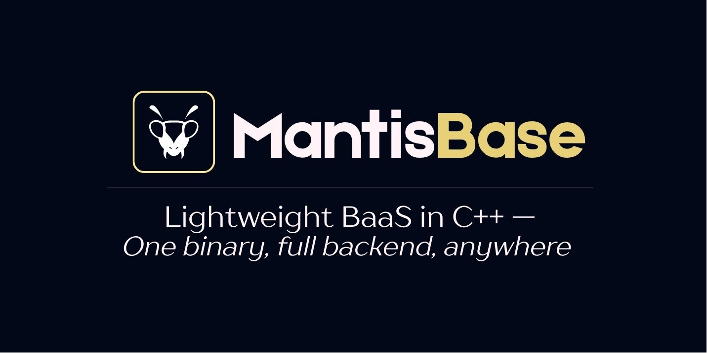

> [!IMPORTANT]
> **MantisBase is being reworked in Rust.** This repository is the active rewrite. Behaviour and APIs may differ from earlier C++ releases, and **feature parity is not guaranteed yet**—some capabilities described in older marketing or in `doc/` may be planned, partial, or unchanged only on legacy binaries. Treat this notice as authoritative until it is removed.

<p align="center">
  
</p>

<p align="center">
  <strong>A lightweight Backend-as-a-Service (BaaS) in Rust — single binary, schemas, REST, and an admin UI</strong><br />
  Local <strong>libSQL</strong> by default; <strong>Turso</strong> and <strong>PostgreSQL</strong> are included in the binary and chosen at runtime (<code>--db</code>).
</p>

---

## What is MantisBase?

MantisBase is a small backend you run yourself: define **entity schemas**, get **JSON REST** routes, enforce **access rules**, serve the **admin dashboard** under `/mb`, and optionally register **webhooks**. **Admin accounts** live in a dedicated table; **application users** (JWT login) use a single central **`mb_user`** table—not a special entity type in the catalog.

The rewrite targets the same product goals as the original C++ stack (speed, embeddability, clarity) with a smaller runtime surface while features land incrementally.

---

## Quick start (this tree — Rust)

### Prerequisites

- [Rust](https://rustup.rs/) (see `rust-version` in `Cargo.toml`)

PostgreSQL is supported via the bundled **sqlx** client; no separate Cargo feature is required. You only need a running Postgres instance when using `--db postgresql`.

### Build troubleshooting (`Disk quota exceeded` in `/tmp`)

Native dependencies (**`ring`**, **`libsql-sqlite3-parser`**, etc.) invoke the C compiler, which often writes temporary `.s` files under **`/tmp`**. If that filesystem is full or over **quota**, you will see errors like `error writing to /tmp/cc….s: Disk quota exceeded`.

Point the compiler at a directory on a volume with space:

```bash
mkdir -p /path/with/quota/headroom/tmp
export TMPDIR=/path/with/quota/headroom/tmp
cargo build
```

Optionally also set `CARGO_TARGET_DIR` to a path on the same volume if your default target dir is quota-limited.

### Build and run

```bash
git clone https://github.com/allankoechke/mantisbase.git
cd mantisbase
cargo build --release
```

Build the admin SPA (Vite → `public/mb-dist/`, served at `/mb/`):

```bash
cd admin && npm install && npm run build && cd ..
```

Apply migrations, then serve (first admin via setup wizard or CLI):

```bash
./target/release/mantisbase migrations up
export MB_JWT_SECRET='a-long-random-secret-for-user-jwt'   # optional but recommended
./target/release/mantisbase serve
```

If **no admin account** exists, `serve` prints a **one-time setup URL** (valid 20 minutes, single use) such as `http://127.0.0.1:7070/mb/setup?token=…` and tries to open it in your browser. Complete the form to create the first admin. Alternatively:

```bash
./target/release/mantisbase admins add admin@example.com 'your-admin-password'
```

For CI and automated runs, skip setup and the browser prompt:

```bash
./target/release/mantisbase serve --skip-setup
# or: export MB_SKIP_ADMIN_SETUP=1 && ./target/release/mantisbase serve
```

Defaults:

- API: `http://127.0.0.1:7070/api/v1/`
- Admin UI: `http://127.0.0.1:7070/mb/` — **compiled** assets from `./public/mb-dist` (override with `--admin-ui-dir` or `MB_ADMIN_UI_DIR`). Use **HTTP Basic** or a **Bearer** token from `POST /api/v1/admins/auth/login` where the UI calls the API.

OpenAPI for the running shape of the API: `GET /api/v1/openapi.json`.

### First-admin setup (`/mb/setup`, `/api/v1/setup/*`)

When the database has no admins: **`GET /api/v1/setup/status?token=…`**, **`POST /api/v1/setup/first-admin`** with `Authorization: Bearer <setup-token>` and `{ "email", "password" }`. The setup token is invalidated after use or once any admin exists.

### Admin accounts over HTTP (`/api/v1/admins`)

Use **`POST /api/v1/admins/auth/login`** with `{"email":"…","password":"…"}` (no prior auth) to obtain `{ "token", "admin" }` — send the token as `Authorization: Bearer …` on admin routes. Alternatively use **HTTP Basic** (`email:password`) on the same routes.

With admin auth: **`GET /api/v1/admins`** lists admins; **`GET /api/v1/admins/{id-or-email}`** returns one admin; **`POST /api/v1/admins`** creates another; **`DELETE /api/v1/admins/{id-or-email}`** removes one (URL-encode the path segment). Admin JWTs include **`id`**, **`email`**, and **`sub`** (id). The CLI `mantisbase admins …` commands do the same against the database.

### Create a schema (admin auth)

Admin routes accept `Authorization: Basic …` or `Authorization: Bearer …` with a JWT from **`POST /api/v1/admins/auth/login`** (same `MB_JWT_SECRET` as application user tokens; admin JWTs include `aud: mantisbase_admin`).

```bash
curl -sS -u 'admin@example.com:your-admin-password' \
  -X POST http://127.0.0.1:7070/api/v1/sys/schemas \
  -H 'Content-Type: application/json' \
  -d '{
    "name": "posts",
    "type": "base",
    "fields": [
      {"name": "title", "type": "string", "required": true},
      {"name": "content", "type": "string"}
    ],
    "rules": {
      "list": {"mode": "public", "expr": ""},
      "get": {"mode": "public", "expr": ""},
      "add": {"mode": "auth", "expr": ""},
      "update": {"mode": "auth", "expr": ""},
      "delete": {"mode": "", "expr": ""}
    }
  }'
```

**Entity types** (catalog): **`bare`**, **`base`**, **`view`** — there is no `auth` entity type; end-user sign-in is via **`POST /api/v1/auth/login`** against `mb_user`.

### Application user login

```bash
curl -sS -X POST http://127.0.0.1:7070/api/v1/auth/login \
  -H 'Content-Type: application/json' \
  -d '{"email":"user@example.com","password":"user-password"}'
```

Response includes `token` (JWT) and `user` JSON. Use `Authorization: Bearer <token>` on routes whose rules require authenticated access.

---

## What is implemented vs legacy docs

Rough map for **this Rust codebase** (check `src/http/mod.rs` and OpenAPI for truth):

| Area | Status |
|------|--------|
| Health, OpenAPI, CORS, request logging | Implemented |
| `GET|POST /api/v1/sys/schemas`, `GET|DELETE …/sys/schemas/{name}` (admin) | Implemented |
| `GET|PATCH /api/v1/sys/configs` (admin), `GET /api/v1/sys/logs` (admin, stub) | Implemented |
| Entity row CRUD under `/api/v1/entities/...`, access rules | Implemented |
| Admin users: CLI or `GET|POST /api/v1/admins`, `DELETE /api/v1/admins/{id}` (Basic) | Implemented |
| `mb_user` + `POST /api/v1/auth/login` + JWT | Implemented |
| `GET|POST /api/v1/webhooks` (admin) | Implemented |
| Admin dashboard `/mb/` | Compiled Vite app (default `./public/mb-dist`) |
| SSE realtime, file pipeline, refresh/logout auth routes, Duktape scripting, … | **Not** promised here; older `doc/*.md` may still describe the C++ server |

When in doubt, prefer **`openapi.json`** and this README over historical prose.

---

## CLI overview

| Command | Purpose |
|---------|---------|
| `mantisbase serve` | HTTP server (`--host`, `--port`) |
| `mantisbase admins …` | Add, list, or remove admin users |
| `mantisbase migrations …` | Apply or reset SQL migrations |

Global flags include `--data-dir`, `--admin-ui-dir` (built SPA root), `--dev`, `--db` (`libsql` \| `turso` \| `postgresql`), and `--db-url` (or `MB_DATABASE_URL`). Turso typically needs `MB_TURSO_AUTH_TOKEN`.

---

## Configuration (environment)

| Variable | Role |
|----------|------|
| `MB_JWT_SECRET` | Required to issue JWTs from `/api/v1/auth/login` |
| `MB_ADMIN_UI_DIR` | Directory with built admin `index.html` (default `./public/mb-dist`) |
| `MB_DATABASE_URL` | DB URL when using Turso/Postgres (or pass `--db-url`) |
| `MB_TURSO_AUTH_TOKEN` | Turso auth token when `--db turso` |
| `MB_LOG_LEVEL` | `trace` … `critical` |
| `MB_SKIP_ADMIN_SETUP` | If truthy (`1`, `true`, `yes`, `on`), skip first-admin setup URL and browser (same as `--skip-setup`) |

---

## Project layout (Rust)

```
mantisbase/
├── src/              # Library + `mantisbase` binary (CLI, HTTP, storage)
├── admin/            # Vite + TypeScript admin UI (`npm run build` → `public/mb-dist/`)
├── migrations/       # libSQL / Turso SQL migrations
├── migrations/postgres/
├── public/mb-dist/   # Built admin bundle (served at `/mb/`; gitignored)
├── tests/
└── doc/              # Legacy / long-form guides (may predate the Rust port)
```

---

## Optional Cargo features

- **`smtp`** — email (lettre)
- **`embed-js`** — experimental QuickJS embedding

Example: `cargo build --release --features smtp`

---

## Documentation and status

- **API:** `GET http://<host>:<port>/api/v1/openapi.json`
- **Hosted book / site:** may track releases; verify against this branch.
- **Contributing:** [CONTRIBUTING.md](CONTRIBUTING.md)

MantisBase remains under active development; breaking changes are possible while the Rust port catches up to the full prior surface.

---

## Contributing

Contributions are welcome. See [CONTRIBUTING.md](CONTRIBUTING.md).

---

## License

MIT License © 2026 Allan K. Koech

---

## Resources

- [GitHub repository](https://github.com/allankoechke/mantisbase)
