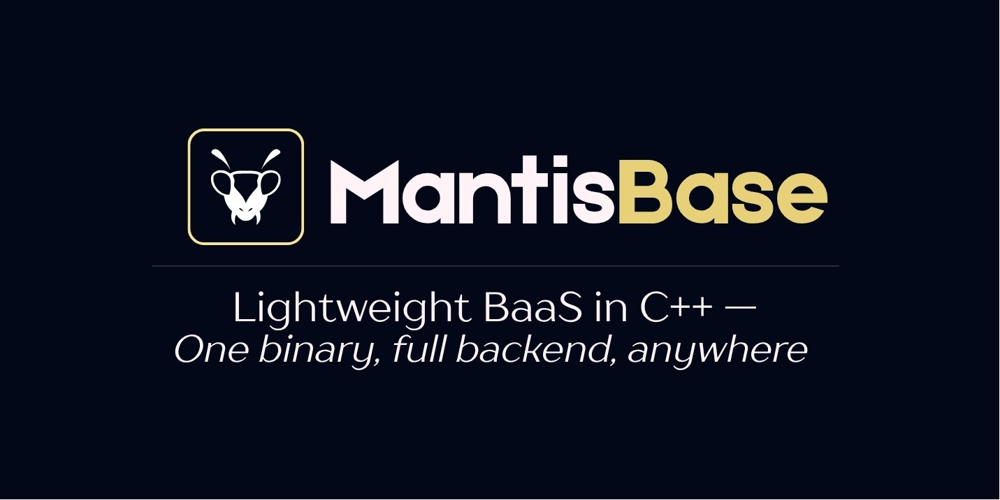

<p align="center">
  
</p>

<!-- Hero GIF: replace the line below with the actual GIF once recorded -->
<!--  -->

<p align="center">

[](https://github.com/allankoechke/mantisbase/actions/workflows/ci.yml)
[](https://github.com/allankoechke/mantisbase/releases)
[](LICENSE)
[](https://hub.docker.com/r/allankoech/mantisbase)
[](https://github.com/allankoechke/mantisbase/discussions)

</p>

**MantisBase is a self-hosted C++20 BaaS — one binary gives you instant REST APIs, authentication, realtime SSE, file uploads, and a web admin dashboard.**

Perfect for embedded devices, desktop apps, or standalone servers. No runtime dependencies.

---

## Quick Start

**1. Run it**

```bash
# Option A: Download the latest binary from GitHub Releases
wget https://github.com/allankoechke/mantisbase/releases/latest/download/mantisbase_linux-x86_64.zip
unzip mantisbase_linux-x86_64.zip
./mantisbase serve

# Option B: Docker (one-liner)
docker run -p 7070:80 allankoech/mantisbase
```

The server starts on `http://localhost:7070` with the API at `/api/v1/` and admin dashboard at `/mb`.

**2. Create your admin account**

Visit `http://localhost:7070/mb` to create your admin credentials via the dashboard, or use the CLI:

```bash
./mantisbase admins --add admin@example.com your_strong_password
```

**3. Build your backend**

Create entities (tables) from the admin dashboard or via the REST API — endpoints are generated instantly.

```bash
# Example: list records from an entity you created
curl http://localhost:7070/api/v1/entities/posts
```

That's it — you have a full backend with auth, realtime, and file uploads in under a minute.

---

## Why MantisBase?

| Feature | MantisBase | PocketBase | Supabase | Firebase |
|---|---|---|---|---|
| Language | C++20 | Go | Elixir/Postgres | Proprietary |
| Single binary | ✅ | ✅ | ❌ | ❌ |
| Self-hosted | ✅ | ✅ | ✅ | ❌ |
| Embeddable in C++ | ✅ | ❌ | ❌ | ❌ |
| Realtime (SSE) | ✅ | ✅ | ✅ | ✅ |
| Admin dashboard | ✅ | ✅ | ✅ | ✅ |
| Auth & access rules | ✅ | ✅ | ✅ | ✅ |
| File uploads | ✅ | ✅ | ✅ | ✅ |
| Open source | MIT | MIT | Apache 2.0 | ❌ |

---

## Features

- **Auto-generated REST APIs** — create a table, get CRUD endpoints instantly → [API Reference](doc/02.api.md)
- **Built-in authentication** — JWT-based auth with login, refresh, logout → [Auth API](doc/02.auth.md)
- **Access control rules** — public, auth, or custom expression-based permissions → [Access Rules](doc/03.rules.md)
- **Realtime updates** — SSE streams for live database changes (SQLite & PostgreSQL) → [API Reference](doc/02.api.md)
- **Admin dashboard** — web UI for managing schemas, records, users, and files → [Quick Start](doc/QuickStart.md)
- **File uploads** — multipart upload and serving tied to entity records → [File Handling](doc/11.files.md)
- **Embeddable** — use as a C++ library in your own application → [Embedding Guide](doc/05.embedding.md)
- **JavaScript extensions** — extend with custom routes and logic → [Scripting Guide](doc/13.scripting.md)


---

## Configuration

MantisBase supports SQLite (default) and PostgreSQL, with all options configurable via CLI flags or environment variables:

```bash
# Custom port and host
mantisbase serve --port 8080 --host 0.0.0.0

# Use PostgreSQL instead of SQLite
mantisbase --db postgresql --db_url "dbname=mydb host=localhost user=postgres password=pass" serve

# Development mode (verbose logging, relaxed JWT defaults)
mantisbase --dev serve
```

Set `MB_JWT_SECRET` in production for secure token signing. See the [CLI Reference](doc/01.cmd.md) for all options.

---

## Install

| Method | Details |
|---|---|
| **Pre-built binary** | Download from [GitHub Releases](https://github.com/allankoechke/mantisbase/releases), extract, and run `./mantisbase serve` → [Installation Guide](doc/00.installation.md) |
| **Docker** | `docker run -p 7070:80 allankoech/mantisbase` → [Docker Guide](doc/06.docker.md) |
| **Build from source** | `git clone --recurse-submodules https://github.com/allankoechke/mantisbase.git && cd mantisbase && cmake -B build && cmake --build build` → [Installation Guide](doc/00.installation.md) |
| **Embed in C++** | Add as a CMake submodule and `#include <mantisbase/mantisbase.h>` in your app → [Embedding Guide](doc/05.embedding.md) |

> **Requirements**: C++20 compiler (GCC/MinGW 13+). Linux builds need `libzstd-dev` and `libpq-dev` for PostgreSQL support. No external runtime dependencies — everything is bundled.

---

## Documentation

| Doc | Description |
|---|---|
| [Quick Start](doc/QuickStart.md) | Get running in under 2 minutes |
| [Installation](doc/00.installation.md) | Binary, source, and embedding setup |
| [CLI Reference](doc/01.cmd.md) | Command-line options and flags |
| [API Reference](doc/02.api.md) | REST endpoints, schemas, and realtime SSE |
| [Authentication](doc/02.auth.md) | Auth endpoints and JWT flow |
| [Access Rules](doc/03.rules.md) | Permission system and expressions |
| [Docker](doc/06.docker.md) | Container deployment |
| [File Handling](doc/11.files.md) | Upload and serve files |
| [Health Check](doc/12.healthcheck.md) | Monitoring endpoint |
| [Scripting](doc/13.scripting.md) | JavaScript extensions |

Full API docs: [docs.mantisbase.dev](https://allankoechke.github.io/mantisbase/)

---

## Community

Questions, ideas, or feedback? Join the conversation on [GitHub Discussions](https://github.com/allankoechke/mantisbase/discussions).

Watch the [YouTube playlist](https://youtube.com/playlist?list=PLsG0sKNmNpyQwsZuReuqo_nl_j4SdJoiJ&si=a9jFK4QjFJb06NAw) for tutorials and walkthroughs.

## Contributing

Contributions are welcome! See [CONTRIBUTING.md](CONTRIBUTING.md) for guidelines on how to get involved.

## License

[MIT](LICENSE) © 2025 Allan K. Koech
