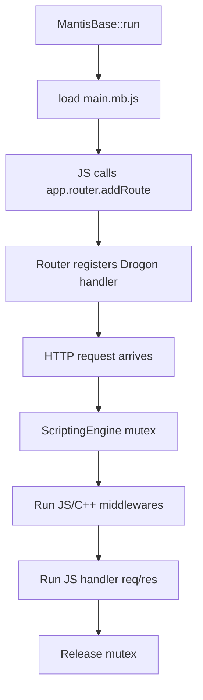

# Restore Duktape Scripting (Issue #118)

## Current state

Scripting is **compile-time optional** (`MB_SCRIPTING_ENABLED=OFF` default) and **partially implemented**:

| Works today | Broken / missing |
|---|---|
| Duktape heap init/destroy | `Router::addRoute` — stubbed in [`src/mantisbase.cpp:643`](src/mantisbase.cpp) |
| `app.*` properties, `app.db()`, `app.router()` | `MantisRequest`/`MantisResponse` bindings — empty stubs |
| `db.query()`, `db.session()`, transactions | `get_duk`/`set_duk` reference removed `m_store` — **won't compile** with flag ON |
| Global utils (not `utils.*`) | `app.settings()`, `app.auth()`, middlewares, lifecycle hooks |
| Loads `index.mantis.js` | No thread lock on shared `duk_context` |

Pre-Drogon implementation exists in git (`d604aede` router, `fd9f8a9a` req/res) and is the primary port reference.



---

## Phase 1 — Reorganize into `src/scripting/`

Move all Duktape glue out of domain files into a dedicated module for easier maintenance.

**New layout:**

```
src/scripting/
  scripting_engine.cpp/h       # init, load, mutex-guarded eval/call, deadman switch
  hooks.cpp                    # ScriptingHooks + console (from duktape_wrapper.cpp)
  bindings/
    app_bindings.cpp             # app props/methods: db, router, settings, auth, files, logs, rt, loadScript
    router_bindings.cpp          # addRoute, executeRoute (port from d604aede)
    request_bindings.cpp         # MantisRequest (port from fd9f8a9a, skip trailers)
    response_bindings.cpp        # MantisResponse + sendJson(DukValue)
    database_bindings.cpp        # Database::register + query(duk_context*)
    settings_bindings.cpp        # KeyValStore get/set/configs
    auth_bindings.cpp            # Auth createToken, verifyToken, sessionTimeout, etc.
    middleware_bindings.cpp      # middlewares.* factories → JS-callable wrappers
    utils_bindings.cpp           # utils object (move from dukglue_utils_bindings.cpp)
    files_bindings.cpp           # FilesMgr essentials
    logs_bindings.cpp            # Logger read helpers
    realtime_bindings.cpp        # RealtimeDB publish/subscribe surface

include/mantisbase/scripting/scripting_engine.h
```

**Domain files become thin:**
- Remove `#ifdef MB_SCRIPTING_ENABLED` blocks from [`src/core/database.cpp`](src/core/database.cpp), [`src/core/http_request.cpp`](src/core/http_request.cpp), [`src/core/http_response.cpp`](src/core/http_response.cpp), [`src/mantisbase.cpp`](src/mantisbase.cpp) — delegate to `ScriptingEngine`.
- Delete or redirect [`src/utils/dukglue_utils_bindings.cpp`](src/utils/dukglue_utils_bindings.cpp) and [`src/core/private-impl/duktape_wrapper.cpp`](src/core/private-impl/duktape_wrapper.cpp).
- Update [`CMakeLists.txt`](CMakeLists.txt) source list.

**Thread safety — single context + mutex (v0.4.x default):**

Duktape heaps/contexts are **not thread-safe**. Drogon serves requests on worker threads, so all `duk_*` / `dukglue_pcall` calls must be serialized.

**Decision: do NOT use a warm pool of Duktape instances for the initial restore.** Use one shared `duk_context` guarded by `std::mutex` in `ScriptingEngine`.

Why a warm pool is the wrong default here:

| Concern | Single context + mutex | Pool of warm contexts |
|---|---|---|
| Correctness | Straightforward | `DukValue` handlers are **heap-bound** — a function captured in context A cannot run in context B |
| Startup | One `main.mb.js` eval | Each context needs full binding registration + script re-eval |
| Route registration | JS `addRoute` captures handlers once; C++ registers Drogon routes once | Either duplicate Drogon registration per context, or store route metadata in C++ and re-bind handlers per heap |
| Memory | One heap (~low MB) | N × heap size |
| `loadScript()` at runtime | Trivial | Must fan out to every live context or accept inconsistency |
| Duktape design | Matches typical embed pattern | Duktape has no context-clone; `duk_push_thread` is coroutine-only, still single-threaded |

When would a pool be worth it?

- Custom JS routes become **high QPS** and profiling shows mutex contention on `ScriptingEngine`
- Handlers do **long CPU/IO work** in JS (anti-pattern — should delegate to C++ / async)

If that happens later, better escalation paths (in order of complexity):

1. **Keep mutex, document "keep JS handlers fast"** — sufficient for most BaaS scripting (hooks, small glue routes)
2. **Dedicated JS worker thread** — queue `(handler, req, res)` to one thread; no cross-heap duplication, but adds latency
3. **Per-Drogon-thread context** — at `listen()` time, create one heap per worker, re-run `initBindings()` + `main.mb.js` on each; store handlers in thread-local storage keyed by route id (significant complexity)
4. **Warm pool with borrow/return** — same per-heap duplication problem as (3), plus pool management overhead

For issue #118 restore scope, **(1) is the correct choice**. Add a brief note in `doc/scripting.md` that handlers run under a global script lock and should avoid blocking work.

---

## Phase 2 — Restore router + req/res (custom routes)

Port [`RouterUnit::bindRoute`](d604aede) / `executeRoute` to modern [`Router`](include/mantisbase/core/router.h):

```js
app.router().addRoute("GET", "/api/v1/custom/health", handler, ...middlewares)
```

**Implementation in `router_bindings.cpp`:**
1. `addRoute(method, path, handler, ...middlewares)` — validate method/path, capture `DukValue` handler + middlewares.
2. Register via existing `Router::Get/Post/Patch/Delete` (same path conversion `/:param` → `/{param}` already in [`src/core/http.cpp`](src/core/http.cpp)).
3. `executeRoute(ctx, handler, middlewares, req, res)`:
   - Run middlewares first; JS middleware returns `bool` (legacy contract), C++ middleware returns `HandlerResponse` mapped to continue/abort.
   - On JS middleware `false` or C++ `Handled`, stop chain.
   - Call handler via `dukglue_pcall` (void return).

**Request bindings** — restore from `fd9f8a9a`, **drop trailer APIs** (removed from Drogon wrappers). Fix context store:

```148:152:include/mantisbase/core/http.h
#ifdef MB_SCRIPTING_ENABLED
        DukValue get_duk(const std::string &key);
        DukValue getOr_duk(const std::string &key, const DukValue &default_value);
        void set_duk(const std::string &key, const DukValue &value);
#endif
```

Reimplement `set_duk`/`get_duk`/`getOr_duk` against Drogon `m_req->attributes()` (same storage as C++ `set()`/`getOr()`), with DukValue ↔ `std::any` conversion (reuse patterns from [`src/core/context_store.cpp`](src/core/context_store.cpp)).

**Response bindings** — restore `sendJson(int, DukValue)` (parse JS object/string to JSON body), plus `json`, `text`, `html`, `send`, `redirect`, header/body/status properties.

---

## Phase 3 — Expose app modules to JS

Extend `app` bindings (via thin `duk_*()` pointer methods on `MantisBase`):

| JS API | C++ source | Key methods |
|---|---|---|
| `app.db()` | existing | `query`, `session`, transactions — already done, move to bindings dir |
| `app.settings()` | `KeyValStore` | `get(key, default?)`, `set(key, value)`, `configs()` (read-only copy), `reload()` |
| `app.auth()` | `Auth` | `createToken`, `verifyToken`, `deleteSession`, `refreshSession`, `sessionTimeoutSeconds` |
| `app.files()` | `FilesMgr` | upload path helpers, resolve URL — expose safe read-oriented subset |
| `app.logs()` | `Logger` | `info/warn/error/debug(category, msg)` wrappers |
| `app.rt()` | `RealtimeDB` | publish/broadcast essentials used by dashboards |
| `app.loadScript(path)` | `MantisBase::loadScript` | relative to scriptsDir |

**Settings binding** — wrap [`KeyValStore::configs()`](src/core/kv_store.cpp) with JSON round-trip for JS objects; `set` updates in-memory config + persists via existing `applyPatch` logic (add a small `setConfigKey(path, value)` helper if needed rather than exposing raw mutable JSON).

**Utils namespace fix** — register a global `utils` object (matching docs) instead of bare globals; keep globals as deprecated aliases for one release if desired.

**Middlewares object** — global `middlewares` with factories from [`include/mantisbase/core/middlewares.h`](include/mantisbase/core/middlewares.h):

```js
app.router().addRoute("GET", "/protected", handler, middlewares.getAuthToken(), middlewares.hydrateContextData())
```

Each factory returns a JS function `(req, res) => bool` that wraps the C++ `MiddlewareFn` under the scripting mutex. Include parameterized ones: `hasAccess(entity)`, `requireExprEval(expr)`, `settingsFeatureGate(key)`, `rateLimit(...)`.

---

## Phase 4 — Script pipeline, entry point, deadman switch

**Entry point** (per your choice):
- Primary: `scriptsDir/main.mb.js`
- Fallback: `index.mantis.js` with deprecation log
- Update [`loadStartScript()`](src/mantisbase.cpp) accordingly

**Lifecycle hooks** — wire existing [`ScriptingHooks`](src/core/private-impl/duktape_wrapper.cpp):
- `onServerStart()` — after `loadStartScript()`, before `listen()`
- `onRecordCreated(entity, id)` / `onRecordUpdated(entity, id)` — call from [`Entity::create`](src/core/models/entity_crud.cpp) / [`Entity::update`](src/core/models/entity_crud.cpp) when `#ifdef MB_SCRIPTING_ENABLED`

**Deadman switch** (issue requirement):
- CLI: `--disable-scripting` / `--no-scripting`
- Env: `MB_SCRIPTING_DISABLED=1`
- When active: skip `initJSEngine`, skip `loadStartScript`, log once at startup
- Compile-time gate remains: no scripting code in binary unless `MB_SCRIPTING_ENABLED=ON`

**Init order** (unchanged, verified):
`init()` → `initJSEngine()` (registrations) → `run()` → `loadStartScript()` → `listen()`

---

## Phase 5 — Tests, docs, examples

**Tests** (new `tests/integration/test_integration_scripting.cpp`, gated on `MB_SCRIPTING_ENABLED`):
- Build with `-DMB_SCRIPTING_ENABLED=ON` in CI matrix (optional job)
- Load `tests/scripting/main.mb.js` registering a test route
- HTTP GET custom route → 200 + expected JSON
- `db.query` single-row vs multi-row return shapes
- JS middleware abort (returns false → no handler)
- C++ middleware via `middlewares.getAuthToken()` on unauthenticated request
- Deadman switch skips route registration
- Script error at startup logged, server still starts (non-fatal eval)

**Fix example bug** in [`examples/07-scripting/scripts/index.mantis.js`](examples/07-scripting/scripts/index.mantis.js): single-row COUNT returns object, not array — use `rows.cnt`.

**Docs to update:**
- [`doc/scripting.md`](doc/scripting.md) — entry file, modules table, remove trailer APIs, fix utils/middleware docs, document deadman switch
- [`doc/cmd.md`](doc/cmd.md), [`doc/docker.md`](doc/docker.md), [`examples/07-scripting/README.md`](examples/07-scripting/README.md)
- Rename example script to `main.mb.js`; keep `index.mantis.js` as deprecated copy or remove after note
- [`CONTRIBUTING.md`](CONTRIBUTING.md) — scripting build + test instructions

---

## Security notes (for tests + docs)

- Scripts load **only at startup** from configured `scriptsDir` — not from user HTTP input
- All duk calls serialized via mutex
- Settings `set` should not expose SMTP password write without same redaction rules as REST
- Document that scripting gives full DB access — intended for trusted server-side code only

---

## Suggested implementation order

1. `ScriptingEngine` + directory move (compile with flag ON)
2. Fix req/res bindings + `sendJson` (unblocks unit compile)
3. Router `addRoute` + integration smoke test
4. Settings, auth, middlewares bindings
5. files/logs/rt bindings
6. Hooks + deadman switch
7. Docs, examples, CI job
